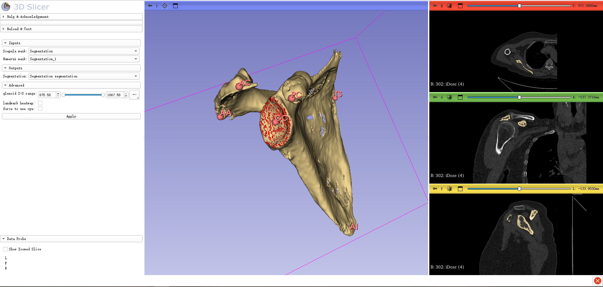

# Deep learning-based Scapular morphology assessment pipeline for glenoid segmentation and landmarks localization
 by Kuan Liu et al.

## Introduction
3D Slicer plugin for scapular morphology assessment (glenoid segmentation and landmarks localization) based on deep-learning methods within 30 seconds.
Corresponding training and inference codes are accessible at [Scapular-Morphology](https://github.com/liukuan5625/ScapulaMorphology).

## Dependencies
This module requires the Pytorch extension which can be installed via the Extension Manager. 
Python dependencies such as MONAI will be automaically installed by the module if not available.
The module internally downloads pretrained model weights to intialize models.

## Tutorial
- Load the shoulder CT scan.
- Create SCAPULA and HUMERUS masks using Segment Editor. Apply a threshold tool with an intensity value > 226 (this parameter can be adjusted as needed). Subsequently, use the Islands tool to isolate and create the scapula and humerus masks.
- Open ScapulaMorphology plugin and select scapula segmentation and humerus segmentation. Press 'Apply' button and wait for the results.

Optional(Advanced): select IS range to modify glenoid inference area. 
Select "Landmark heatmap" will output five landmarks heatmap (TS, AI, PC, AC, AA).
Select "force to use cpu" to inference model on cpu.

If the model weights fail to download, visit https://github.com/liukuan5625/SlicerScapulaMorphology/releases to manually download the weights and sample files, and place them in the folder ./ScapulaMorphology/Scripts.
0
